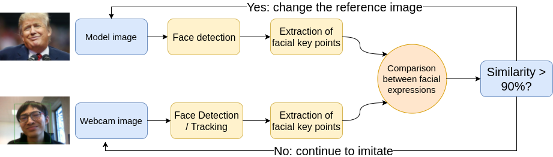
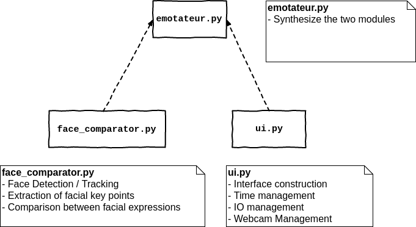

# EMOTATEUR

The french version README is [here](https://github.com/ZHANGHeng19931123/py_emotateur/blob/master/doc/README_FR.md).

## Introduction

<p align="center">
    
</p>

It is a game designed to imitate other people's facial expressions and measure their similarity.

## Home page

When you launch the application, there will be an animation effect: the reference images will appear or disappear randomly.

<p align="center">
    
</p>

## solo-mode

In solo mode, you have **one minute** to imitate the reference facial expressions predefined by the application.
The remaining time will be displayed at the top of the window.

<p align="center">
    
    
    
</p>

## multi-players mode

In multi-player mode, one player will imitate the facial expressions of other players.


<p align="center">
    
    
    
</p>

## Two display modes

You can show or hide the facial key points by clicking the "**Key Points**" button:

<p align="center">
    
</p>

## Examples of reference images

So far, we have collected 20 reference images. In general, they are known and interesting to imitate.

<p align="center">
    
</p>

## How it works

<p align="center">
    
</p>

## Installation

- Install [openpose](https://github.com/CMU-Perceptual-Computing-Lab/openpose) & [PyOpenPose](https://github.com/FORTH-ModelBasedTracker/PyOpenPose);
- Then run:
```bash
python3 emotateur.py
```

## System Architecture

<p align="center">
    
</p>

## Documents

- [Presentation slide](https://docs.google.com/presentation/d/1xqt5ODMEjq2VQG5CXfA-deQM4pDEkuEwCQUqi-MEBYk/edit?usp=sharing)
- [Technique report](https://docs.google.com/document/d/1KEyb6dXMNXon9NAhRNZQWcWrzmU--qV9ne9t6XRb2aE/edit?usp=sharing)

## Team membres

- [Yunyun SUN](https://github.com/syyprime) , [Yutong YAN](https://github.com/melodiepupu) , [Sixiang XU](https://github.com/soarodo) , [Heng ZHANG](https://github.com/ZHANGHeng19931123).

<p align="center">
    
</p>