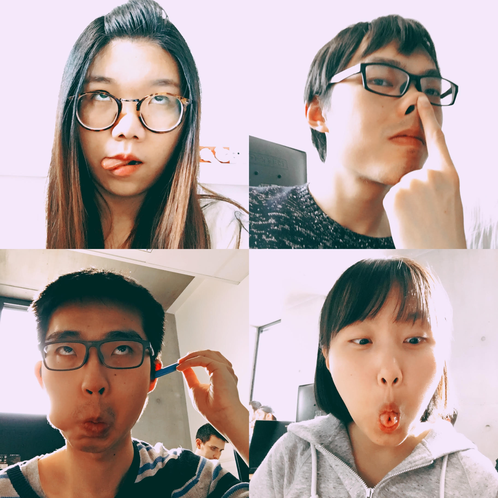

# py_emotateur

## Introduction

We want to create a fun application, in which users can imitate facial expressions of someone and get a note, which allows us to tell us the similarity between model faces and their faces captured in real time.

## Steps

- Install [openpose](https://github.com/CMU-Perceptual-Computing-Lab/openpose);
- Install [PyOpenPose](https://github.com/FORTH-ModelBasedTracker/PyOpenPose);
- Modify the variable `faceBB` in file `emotateur.py` according to your model image.
- Activate the application:
```bash
python3 emotateur.py
```

## Documents

## Membre d'équipe

- SUN Yunyun
- XU Sixiang
- YAN Yutong
- ZHANG Heng

 