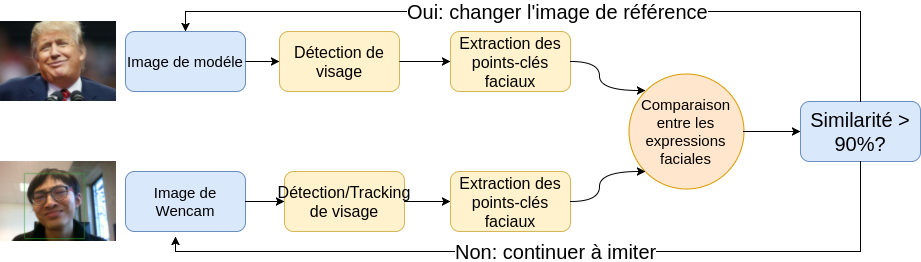
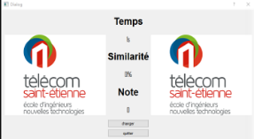

# Projet Emotateur

> C'est un jeu vis à imiter les expressions des visages différents pendant une durée limitée (1 min par exemple) en testant la similarité entre l'imitation et l'image de référence. La note finale tient compte le nombre des coups réussites.

## Description du sujet
 
Dans ce projet, on voudrait créer une application amusante, dans laquelle les utilisateurs peuvent imiter les expressions des visages du modèle et obtiendraient une note, qui permet de nous indiquer la similarité entres les visages modèles et leurs visages capturés en temps réel.

 
## Cahier de charge

De manière spécifique, les objectifs détaillés sont comme suivants :

1. Les visages détectés en temps réel peuvent s’afficher dans l’écran de l’application couramment.
3. La clé de comparaison se situe dans l’extraction des points de caractéristiques de visage. C’est ce qui définit les régions d’intérêt
4. Pour obtenir une note de similarité adéquate, il faut qu’on penne une signature pertinente. Si les signatures ne sont plus assez propres, on aura besoin de les corriger et les mettre sur une forme logique.
2. Il faut que les calculs de la note de similarité prennent peu de temps, dans l’intérêt de renouvellement en temps réel. Autrement dit, il faut qu’on utilise des algorithmes prompts.
5. En plus, pour une bonne expérience en jouant ce jeu, il faut qu’on conçoive une interface pratique. Dans lequel on pourrait changer le modèle si celui-ci bloquait les utilisateurs. Et il y aura un chronomètre, car ce jeu se passe dans une période limite et les utilisateurs peuvent saisir le temps reste facilement.

 

## L'architecture su système

## Continuation de 'Projet couleur'

Dans le dernier semestre, nous avons déjà fait une partie du projet. Les taches déjà réalisées sont :

1. Construction d'interface graphique d’application ;

1. Réalisation de détection de visage en utilisant l'algorithme **Viola-Jones**;
1. Extraction des points de caractéristique d'un visage en utilisant l'approche **Active Shape Model(ASM)**;
1. Comparaison entre deux expressions de visage selon les points de caractéristiques.

Maintenant, on voudrait continuer et améliorer notre projet. Donc ce que nous allons réaliser continent :

1. Amélioration d'interface graphique :
    1. Support multi-langage (Français Anglais Chinois) ;
    1. Permets d'enregistrer les résultats d’imitation par les utilisateurs dans un fichier ;
    1. Rajouter une fenêtre pour visualiser les résultats de détection de visages et extraction des points de caractéristique de visage en temps réel ;
    1. Adapter a cameras de résolution différente ;
1. Amélioration des algorithmes de détection de visage et d’extraction des points de caractéristique de visage. Maintenant, nous allons implémenter l'approche 'machine learning' et 'deep learning'. Ça veut dire nous allons entrainer un modèle de réseau neuronal et essayer d'acquérir une performance d'état de l'art.

 

## Compétences acquis

- Compréhension basique sur '**machine learning**' et '**deep learning**’ ;
- Langage **Python**, **C++**;
- **Qt** pour la construction d'interface graphique ;
- **Tensorflow** pour l'entrainement de réseau neuronal.

## Membre d'équipe

- SUN Yunyun
- XU Sixiang
- YAN Yutong
- ZHANG Heng

 