# EMOTATEUR

## Introduction

<p align="center">
    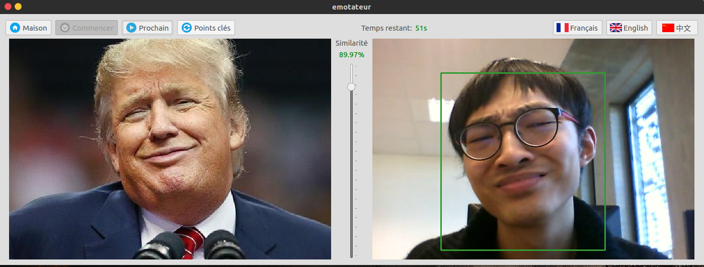
</p>

C'est un jeu vis à imiter les expressions faciales d'autre personne et mesurer la similarité entre les expressions faciales d’imitation et de référence.

## Page d'accueil

Lorsque vous lancez l’application, il y aura un effet d'animation: les images de référence vont apparaître ou disparaître aléatoirement.


<p align="center">
    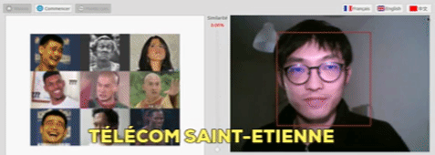
</p>

## solo-mode

En solo mode, vous avez **une minute** pour imiter les images de référence prédéfini par l’application. 
Le temps restant sera affiché en haut de la fenêtre. 

<p align="center">
    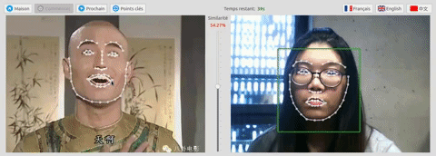
    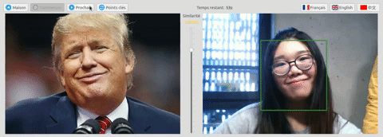
    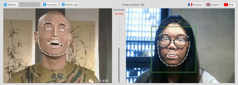
</p>

## multi-joueurs mode

En multi-joueurs mode, un joueurs imite les expressions faciales de l'autre.


<p align="center">
    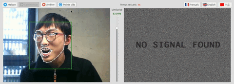
    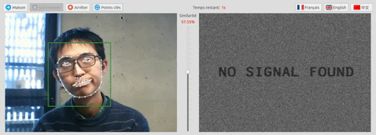
    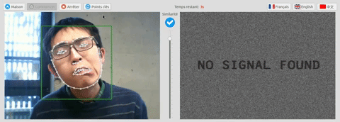
</p>

## Deux modes d’affichage

Vou pouvez afficher ou cacher les points clés faciaux en cliquant le bouton “**Points clés**”:

<p align="center">
    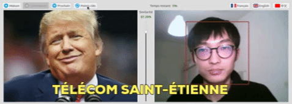
</p>

## Exemples des images de référence

 Jusqu'à maintenant, nous avons collectés 20 images de référence. En général, ils sont connu et intéressante à imiter.

<p align="center">
    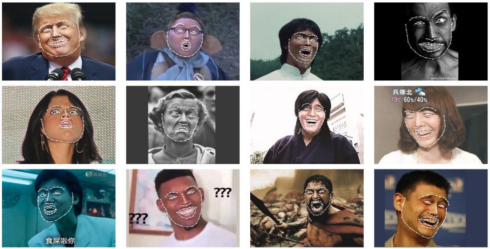
</p>

## Comment ça marche

<p align="center">
    
</p>

## Installation

- Installer [openpose](https://github.com/CMU-Perceptual-Computing-Lab/openpose) & [PyOpenPose](https://github.com/FORTH-ModelBasedTracker/PyOpenPose);
- Ensuit:
```bash
python3 emotateur.py
```

## Architecture du systeme

<p align="center">
    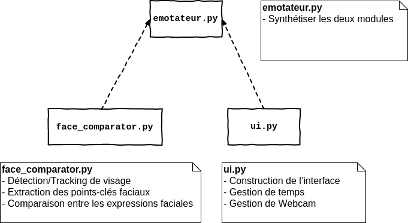
</p>

## Documents

- [Diapositive](https://docs.google.com/presentation/d/1xqt5ODMEjq2VQG5CXfA-deQM4pDEkuEwCQUqi-MEBYk/edit?usp=sharing)
- [Rapport](https://docs.google.com/document/d/1KEyb6dXMNXon9NAhRNZQWcWrzmU--qV9ne9t6XRb2aE/edit?usp=sharing)

## L'équipe

<p align="center">
    
</p>

- SUN Yunyun
- XU Sixiang
- YAN Yutong
- ZHANG Heng